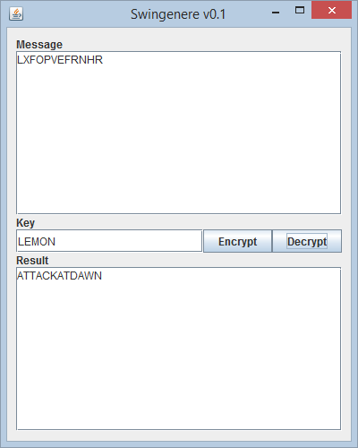

# Swingenere v0.1

A small Swing application built with maven to give a simple front end to the vigenere_util library.



## Installation
In order to install this application from source, first git clone vigenere_util and do a `mvn clean install` on it to add the jar to your local repository.

Then git clone swingenere and call the following command on it:

```
mvn clean package assembly:single
```

---

## TODO
* Add error notification when invalid message or key entered
* Add i18n support
* Consider adding cryptanalysis utils
  * Kasiski examination
  * Friedman test (etc. see Wikipedia)
* Consider add visualization of encryption/decryption
